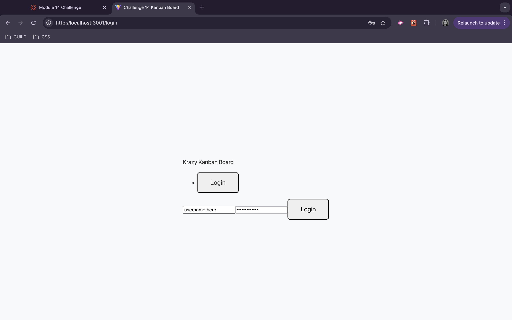

# Challenge 14 Kanban Board 

## Overview
This Kanban board application provides a secure platform for managing tasks using JSON Web Tokens (JWT) for authentication. Users can log in to access and manage their work tasks seamlessly.

## Features
- User authentication with JWT
- Secure login page
- Task management with drag-and-drop functionality
- Responsive design
## Technologies Used
- React
- Node.js
- Express
- PostgreSQL
- JSON Web Tokens (JWT)
- CSS for styling
## Getting Started
### Prerequisites
Before you begin, ensure you have the following installed:

- Node.js
- PostgreSQL
## Installation
Clone the repository:

Copy code
git clone https://github.com/Colby04/Challenge-14-Kanban-Board-.git
cd kanban-board
## Set up the server:

### Navigate to the server directory:
- - cd server
- - Create a .env file and add your database credentials and JWT secret:
- - DB_USERNAME= username here
- - DB_PASSWORD= password here 
- - JWT_SECRET=your_jwt_secret
### Install dependencies:

- npm install
### Start the server:
- npm run dev

### Set up the client:

- Open a new terminal window, navigate to the client directory:
- - cd client
- - Install dependencies:
- - npm install
- - Start the client:
- - npm run dev
### Usage
Open your browser and navigate to http://localhost:3000 to access the application.
Use the login page to authenticate with your credentials.
Once logged in, you can manage tasks on the Kanban board.
## Screenshot

## Links
- GitHub Repository: https://github.com/Colby04/Challenge-14-Kanban-Board-.git
- Deployed Link: http://localhost:3001/

License
This project is licensed under the MIT License.

Acknowledgments
Thanks to all the contributors and resources that helped in the development of this application.
